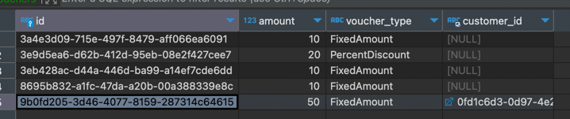

# SpringBoot Basic Weekly Mission

## 📌 과제 설명 <!-- 어떤 걸 만들었는지 대략적으로 설명해주세요 -->

### 흐름도

### 클래스 다이어그램

## ✅ PR 포인트 & 궁금한 점 <!-- 리뷰어 분들이 집중적으로 보셨으면 하는 내용을 적어주세요 -->
- 바우처 지갑 기능을 넣으려고 했는데, 기능 수정이 어려웠습니다.
  - 책임 분리가 덜 되어서 그런건지 확인 부탁드립니다.

## 👩‍💻 요구 사항과 구현 내용 <!-- 기능을 Commit 별로 잘개 쪼개고, Commit 별로 설명해주세요 -->
- [x] 테스트
- [x] Customer
  - [x] 테이블 정의
  - [x] jdbcTemplate
  - [x] crud
- [x] Voucher
  - [x] 테이블 정의
  - [x] jdbcTemplate
  - [x] crud

## ✅ 피드백 반영사항  <!-- 지난 코드리뷰에서 고친 사항을 적어주세요. 재PR 시에만 사용해 주세요! (재PR 아닌 경우 삭제) -->

- 

### Git Commit Convention
* feat : 기능
* fix  : 버그 수정
* docs : 문서 작업
* style: 포맷팅
* refactor : 리팩토링 (기능 변경 X)
* test : 테스트 코드 추가
* chore : 유지 (빌드 작업, 패키지 메니저 작업)