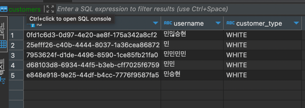

# SpringBoot Basic Weekly Mission
스프링부트 basic 위클리미션을 코드리뷰하는 Repository입니다.

before

after

**클래스 객체 설명**

CustomerService
- 블랙리스트 정보를 저장소에게 요청해서 리스트 형태로 제공하는 역할을 합니다.
- 컨트롤러의 요청을 저장소 객체에게 전달해서 리스트를 반환할 책임이 있습니다.

BlackListRepository
- CustomerService 에서 블랙리스트 정보를 요청 받으면 목록 정보를 반환합니다.
- 블랙리스트 목록 정보를 제공해줄 책임이 있습니다.

CsvRepository
- BlackListRepository 의 구현체로 , csv 형태의 블랙리스트 정보를 리스트 형태로 반환합니다.
- Csv 형태의 목록 파일을 리스트로 변환시키고 반환할 책임이 있습니다.

VoucherService
- 바우처의 등록 , 조회 역할을 담당합니다.
- 컨트롤러에서 요청이 오면 저장소 객체에서 요청해서 리스트를 반환해줄 책임이 있습니다.

VoucherRepository
- 바우처 목록을 저장하고 저장된 목록을 반환합니다.
- VoucherService 에서 요청이 오면 목록 조회 , 등록을 수행할 책임이 있습니다.

MemoryVoucherRepository
- VoucherRepository의 구현체로 리스트 형태로 메모리에 저장하고 리스트 형태로 반환합니다.
- VoucherService 에서 요청이 오면 리스트 형태로 목록 조회 , 등록을 수행할 책임이 있습니다.

CommandLine
- 스프링 어플리케이션이 실행되면 컨트롤러 역할을 수행합니다.
- 클라이언트가 입력값을 넣으면 거기에 해당하는 함수 및 기능을 수행할 책임이 있습니다.
