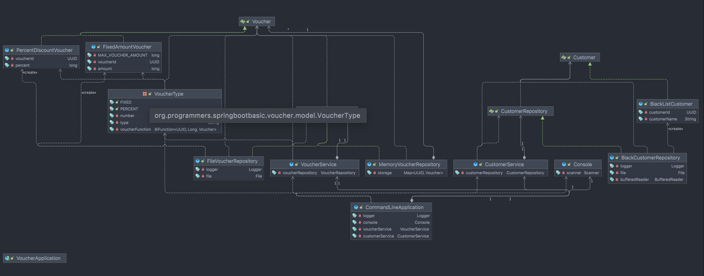

# SpringBoot Weekly Mission

# **바우처 관리 애플리케이션**

<details>
<summary>week 1 Mission</summary>
<div markdown="1">

## 🗒️ 요구사항

---

- [x]  Maven / Gradle 로 프로젝트를 실제로 구성하고 이때 Spring Boot CLI를 개발PC에 설치해서 명령어들을 사용해보고 프로젝트를 만든다. 그리고 IDE (IntelliJ)에서 실행시켜 본다.
- [x]  바우처 관리 Command-line Application을 만들어본다.
    - 참고: [https://dzone.com/articles/interactive-console-applications-in-java](https://dzone.com/articles/interactive-console-applications-in-java)
    - [x]  스프링부트 애플리케이션으로 만든다. (Web기능이 없이만듭니다. 즉, 서버가 띄지 않고 커맨드라인 애플리케이션으로 동작해야한다.)
    - [x]  프로그램이 시작하면 다음과 같이 지원가능한 명령어를 알려준다.

   ```bash
   === Voucher Program ===
   Type **exit** to exit the program.
   Type **create** to create a new voucher.
   Type **list** to list all vouchers.
   ```

    - [x]  create / list 커맨드를 지원한다.
        - create 커맨드를 통해 바우처를 생성할수 있다. (FixedAmountVoucher, PercentDiscountVoucher)
        - list 커맨드를 통해 만들어진 바우처를 조회할 수 있다.
        - 바우처 정보를 매모리에 관리한다. 어플리케이션이 종료가 되어 데이터가 모두 사라져도 괜찮습니다. (나중에 영속성을 가지도록 변경할거에요 걱정마세요!)
- [x]  적절한 로그를 기록하고 `logback` 설정을해서 에러는 파일로 기록된다.
- [x]  실행가능한 `jar` 파일을 생성한다.

(심화) 파일을 통한 데이터관리 기능과 고객 블랙 리스트 명단 관리기능

- [x]  메모리 관리가 아닌 파일로 관리가 되는 Repository를 한번 만들어보세요.
    - 기존 메모리 레포지토리는 지우지 말고 개발 프로파일에서만 동작하게 해보세요.
- [x]  고객 블랙 리스트 명단을 작성한다.
- customer_blacklist.csv 파일을 만들고 스프링 애플리케이션에서 해당 파일을 읽을 수 있고 블랙 리스트조회 할 수있다 (추가할 필요는 없어요. 블랙리스트는 파일로만 관리된다고 가정합니다.)
- [x]  YAML 프라퍼티를 만들고 어떤 설정을 만들수 있을지 고민해본다.

## 📽️ 프로젝트 구조

---


CommandLineApplication을 통해 각각의 명령어를 실행 할 수 있으며,

VoucherService 및 CustomerService가 각각의 도메인으로 해야하는 동작을 수행하도록 합니다.

## ✔️ 피드백 반영 사항

---

## ❓ PR 포인트 & 궁금한 점

---

테스트 코드 작성 경험이 부족하여 이 부분을 공부하며 의문이 많이 생겼습니다.

- mock 객체를 이런식으로 사용하는게 맞을까요?
- throw 처리는 테스트 코드에서 어떤 방법으로 검증하는게 맞을까요?
- 파일 입출력 데이터베이스(BlackCustomerRepository)는 어떤 방법으로 테스트 코드를 작성 해야할까요?

냄새 안나는 코드를 짜려고 노력했는데 부족한 것 같습니다.

그 부분 중점적으로 리뷰 부탁 드립니다. 감사합니다 :)

</div>
</details>

<details>
<summary>week 2 Mission</summary>
<div markdown="1">

# 🗒️ 요구사항
## **(기본)** **바우처 관리 애플리케이션**

- [x]  바우처 관리 애플리케이션에 단위테스트를 작성해보세요.
    - 가능한 많은 단위 테스트코드를 작성하려고 노력해보세요.
    - 엣지 케이스(예외 케이스)를 고려해서 작성해주세요.
    - Hamcrest 의 메쳐들을 다양하게 작성해보고 익숙해져 보세요.
- [x]  바우처 관리 애플리케이션에서도 과정에서 다루었던 고객을 적용해보세요.
    - customer 테이블 정의 및 추가
    - CustomerRepository 추가 및 JdbcTemplate을 사용해서 구현
- [x]  (1주차를 파일로 관리하게 했다.) 바우처 정보를 DB로 관리해보세요.
    - 바우처에 엔터티에 해당하는 vouchers 테이블을 한번 정의해보세요.
    - 바우처 레포지토리를 만들어보세요. (JdbcTemplate을 사용해서 구현)
    - 기존의 파일에서 바우처를 관리한 것을 vouchers 테이블을 통해서 CRUD가 되게 해보세요.

## **(심화)** **바우처 지갑을 만들어보세요.**

- [x]  특정 고객에게 바우처를 할당할 수 있습니다.
- [x]  고객이 어떤 바우처를 보유하고 있는지 조회할 수 있어야 합니다.
- [x]  고객이 보유한 바우처를 제거할 수 있어야 합니다.
- [x]  특정 바우처를 보유한 고객을 조회할 수 있어야 합니다.

# 📽️ 프로젝트 구조

### Main

- Voucher 관리 어플리케이션과 Blacklist를  관리 기능을 분리하기 위하여 콘솔에서는 바우처 관리 어플리케이션만 관리하도록 수정하였습니다.
- CommandType Enum을 추가하여 선택에 따른 서로 다른 동작을 객체로 구분하였습니다.
- io 패키지의  Console 을 Input, Output 인터페이스를 통하여  구현하도록 수정하였습니다.
- wallet을 추가하여 심화 과제의 바우처 id를 통한 고객 조회, 고객 id를 통한 바우처 조회를 구현하였습니다..

### Test

- 계층형으로 단위테스트를 구성하였습니다.
- Repository Test는 강의에서 참고하여 순서대로 실행 되도록 하였습니다.

# ✔️ 피드백 반영 사항 & 부족한 부분

- Wallet의 test case를 작성하였습니다.
- Customer의 test case를 작성하였습니다.
- Voucher Service의 test case를 작성하였습니다.
- exception을 추가하였습니다.
- CommandApplication의 while로직을 합쳤습니다.
- 공통적으로 사용하지 않는 코드를 메소드에서 생성하도록 수정하였습니다.

# ❓ PR 포인트 & 궁금한 점

다음 PR은 빠르게 할 수 있도록 열심히 공부하겠습니다..
21일 커밋 부분 부터 1주차 수정 및 2주차 내용이라, 여기부터 확인해주시면 될 것 같습니다 ! :)

- 예외처리에 대해서 공부하면서 진행하였는데, 제가 놓친 부분 또는 추가적으로 생각해봐야할 부분이 있는지 궁금합니다.
- 테스트 케이스를 BDD와 dci 패턴으로 작성하였는데 굳이 필요하지 않은데 과하다는 생각이 들었습니다.
- 테스트 케이스의 검증을 올바르게 작성하였는지 궁금합니다.
- sql문의 예외처리를 RuntimeException으로 처리 하였는데, Custom Exception을 작성하는 게 좋을까요?  아니면 특정 경우에 따라 여러 종류의 exception을 던지도록 분리하는게 나을까요?
</div>
</details>

<details>
<summary>week 3 Mission</summary>
<div markdown="1">

</div>
</details>