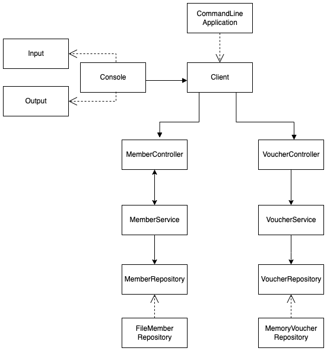

# SpringBoot Basic Weekly Mission

[노션에서 미션 확인가기](https://www.notion.so/backend-devcourse/Part1-3-38f57acca0dd490db11393701417943a)

 

## TODO

 

> pr이 더 늦어질 것같아 피드백 이후 추가하도록 하겠습니다.

 

- logback
- jar
- property

 

## diagram

|          간략한 다이어그램          |
| :---------------------------------: |
|  |

 

## package

- part1
  - configuragtion
    - AppConfiguration.java
  - error
    - member
      - BlackListEmptyException.java : 블랙리스트 멤버 없을 경우
    - voucher
      - FixedAmountException.java : 고정금액 에러
      - PercentErrorException.java : 퍼센트 에러
      - VoucherListEmptyException.java : 바우처 없을 경우
      - VoucherTypeMissingException : 바우처 타입 잘못 입력할 경우
  - io
    - Console.java : Client.java에서 사용할 입출력 기구
    - Input, Output : 콘솔에서 사용할 인터페이스
    - Message.java : 프롬포트에서 사용할 메시지 클래스
  - member
    - entity
      - Member
      - MemberDto.class : csv에서 읽어올 객체
      - MemberType : 과제와 무관
    - repository
      - MemberRepository.java : 제네릭 타입으로 구현한 인터페이스
      - FileMemberRepository.java : csv Read 레포지토리
    - MemberController : ui 계층과 맞닿아 전달만 하는 계층
    - MemberService : 비즈니스 로직 처리 계층
  - order
    - entity
      - Voucher : 인터페이스
      - FixedAmountVoucher
      - PercentAmountVoucher
      - VoucherType : 입출력에서 생성할 경우 판별 할 enum 타입
  - ui
    - client : ui 계층 담당
    - CommandType : 유저가 입력할 명령어 enum 타입

 

## **PR 포인트**

 

1. 에러 처리가 각 클래스별로 책임을 잘 지고 있는지
2. 수업을 듣고 나서 생각한 것이 개발 순서를 domain
   -> controller와 같이 고수준에서 저수준으로 만들고 테스트 케이스를 만드는것이 적합할지
3. 패키지를 어떻게 나누는 것이 좋을지 궁금합니다!
