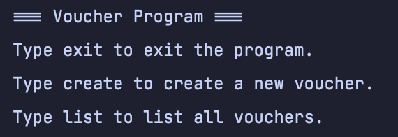
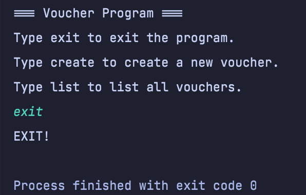
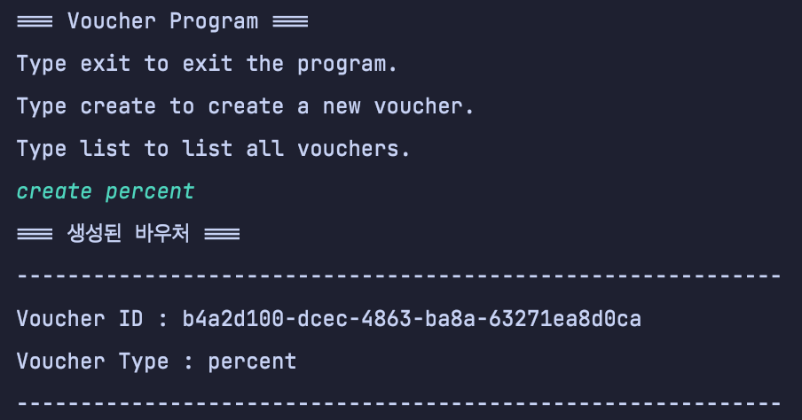
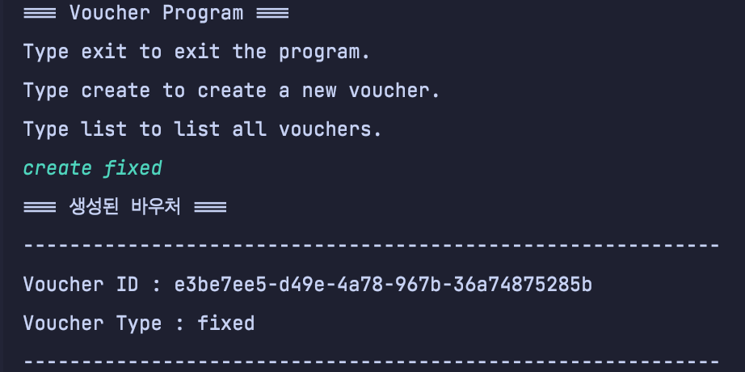
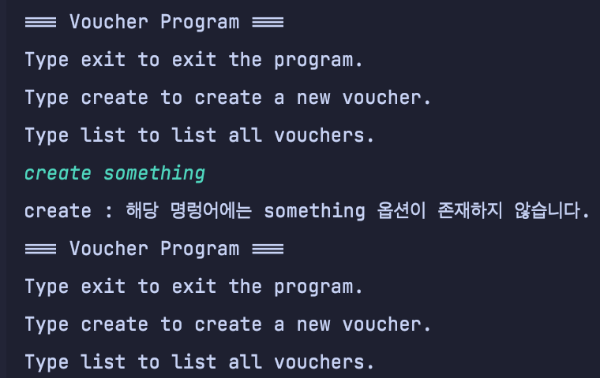
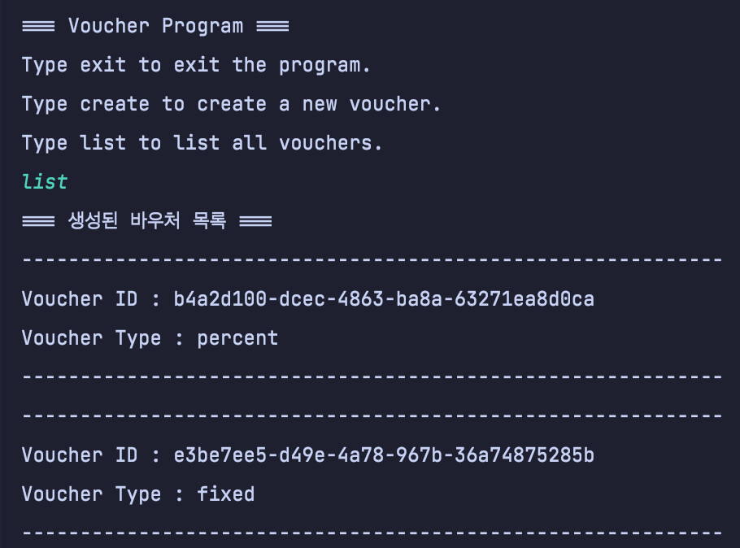

# w3-SpringBoot_Part_A

## 패키지 구조

```bas
├── java
│   └── org
│       └── prgrms
│           └── kdtspringorder
│               ├── App.java
│               ├── AppConfigurationClass.java
│               ├── AppTest.java // 콘솔 어플리케이션을 실행하기 위한 main 메소드가 이곳에 정의되어 있습니다.
│               ├── KdtSpringOrderApplication.java
│               ├── io // 콘솔에서의 입력 및 출력을 담당하는 클래스들을 모아 두었습니다.
│               │   ├── abstraction // 추상 클래스나 인터페이스를 모아 두었습니다.
│               │   │   ├── Input.java
│               │   │   └── Output.java
│               │   ├── domain
│               │   │   └── Command.java
│               │   ├── enums
│               │   │   └── CommandType.java
│               │   ├── exception // 입력 및 출력 과정에서 발생 할 수 있는 예외들을 모아두었습니다.
│               │   │   └── InvalidCommandException.java
│               │   └── implementation // 추상 클래스나 인터페이스에 대한 구현체들을 모아두었습니다.
│               │       └── Console.java
│               ├── order
│               │   ├── OrderTester.java
│               │   ├── domain
│               │   │   ├── abstraction
│               │   │   └── implementation
│               │   │       ├── Order.java
│               │   │       └── OrderItem.java
│               │   ├── enums
│               │   │   └── OrderStatus.java
│               │   ├── exception
│               │   ├── repository
│               │   │   ├── abstraction
│               │   │   │   └── OrderRepository.java
│               │   │   └── implementation
│               │   ├── service
│               │   │   └── OrderService.java
│               │   └── validation
│               └── voucher // 미션-2에서 사용하는 Voucher와 관련된 클래스들을 모아 두었습니다.
│                   ├── domain // 도메인 클래스라 생각하는 것들을 모아두었습니다.
│                   │   └── Voucher.java
│                   ├── enums // Voucher와 관련된 Enum들을 정의해 놓았습니다.
│                   │   └── VoucherPolicy.java
│                   ├── exception 
│                   ├── repository
│                   │   ├── abstraction
│                   │   │   └── VoucherRepository.java
│                   │   └── implementation
│                   │       └── MemoryVoucherRepository.java
│                   ├── service
│                   │   └── VoucherService.java
│                   └── validation
│                       └── CommandValidator.java
└── resources
    └── application.properties
```

## 어플리케이션 사용 예시

### 어플리케이션 실행 방법

- **실행 방법** : [**AppTest.java**](./src/main/java/org/prgrms/kdtspringorder/AppTest.java)에 정의되어 있는 main 메소드 실행시 어플리케이션 실행 가능**

- 앱 실행 화면 :

  

  

### 명령어의 실행 방법 - exit, create, list 3가지 명령어를 제공

#### 1. exit

- ##### 옵션 필요 여부 : x

- ##### 실행 방법 :

  아무런 옵션 없이 `exit` 입력 

- ##### 실행 결과 :

  - 어플리케이션 종료

- ##### 실행 결과 예시 :

  

  

#### 2. create

- ##### 옵션 필요 여부 : o

- ##### 사용 가능한 옵션 : 

  - percent : 비율로 할인해주는 바우처 생성
  - fixed : 고정 된 가격으로 할인해주는 바우처 생성

- ##### 실행 방법 :

  - fixed voucher 생성 : `create fixed` 입력 
  - percent voucher 생성 : ` create percent` 입력

- ##### 실행 결과 :

  - 바우처 생성

- ##### 실행 결과 예시 :

  1. percent

  

  2. fixed

  

  

- ##### 예외 발생 시나리오 :

  1. 옵션 없이  **명령어만** 입력했을 경우 :

     

     

  2. **지원하지 않는 옵션**을 입력한 경우 :

     

     

#### 1. list

- ##### 옵션 필요 여부 : x

- ##### 실행 방법 :

  아무런 옵션 없이 `exit` 입력 

- ##### 실행 결과 :

  - 어플리케이션 종료

- ##### 실행 결과 예시 :

  

  

  

## 커밋 메시지 관련

브랜치를 따고 미션을 시작해야 했는데 로컬에서 먼저 시작해버려서 커밋 메시지가 1개 밖에 없습니다... 😹