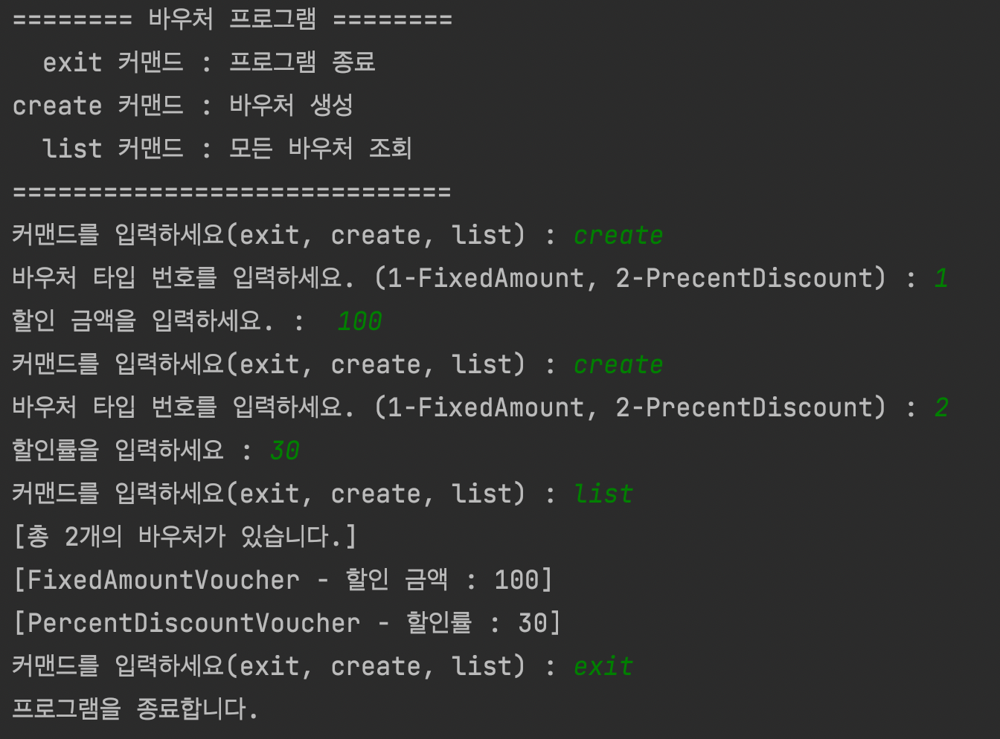

# w3-SpringBoot_Part_A

## [1Week-Mission2] 바우처 관리 커맨드라인 어플리케이션 구현
### 미션 내용
- CommandLineApplication 클래스 작성
- AnnotationConfigApplicationContext를 이용하여 IoC 컨테이너 생성 및 서비스, 레포지토리를 빈으로 등록
- 프로그램 시작 시 지원 가능한 명령어(exit, create, list) 표시
- 바우처는 메모리에 관리(추후에 영속성 가지도록 변경 예정)

### 실행 화면

