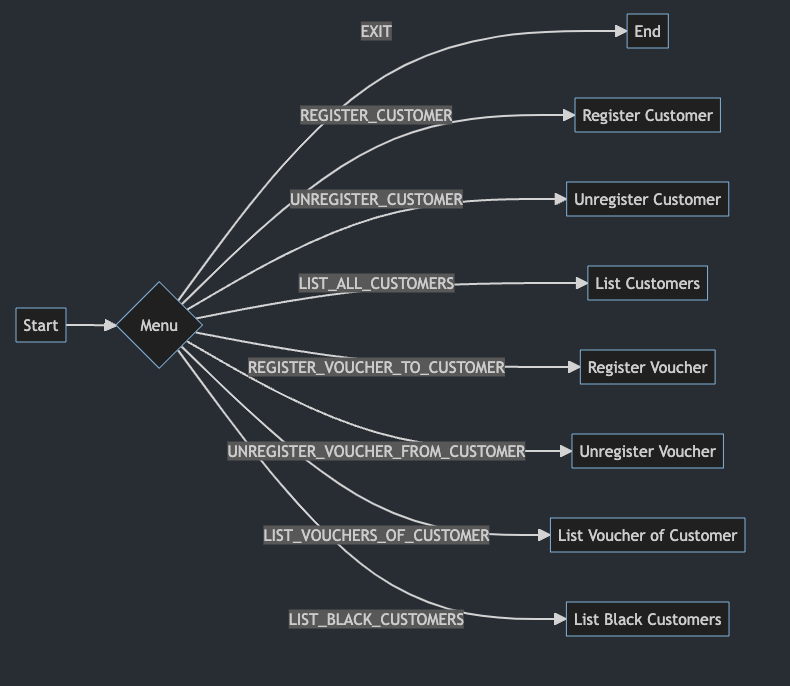
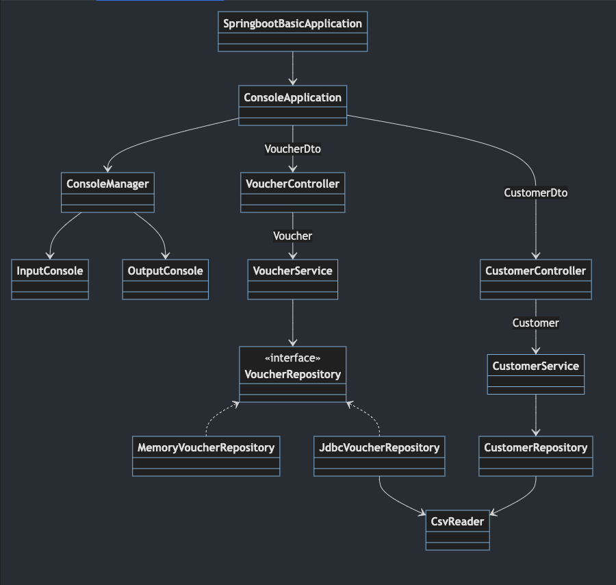

# SpringBoot Basic Weekly Mission

## 📌 과제 설명 <!-- 어떤 걸 만들었는지 대략적으로 설명해주세요 -->

### 흐름도

### 클래스 다이어그램

## ✅ PR 포인트 & 궁금한 점 <!-- 리뷰어 분들이 집중적으로 보셨으면 하는 내용을 적어주세요 -->
wallet 기능 구현에 대해서 봐주셨으면 좋겠습니다.

- voucher 테이블에 customer 외래키를 추가했습니다.
- voucher 도메인 기존 기능에서 외래키에 대한 crud를 추가하면 된다고 생각해 voucher 도메인을 확장했습니다.
- 테이블 간 관계를 최대한 단순하게 갖는것이 좋을 것이라고 생각해 이렇게 구현했는데, 의도에 맞게 구현됐는지 궁금합니다.

## 👩‍💻 요구 사항과 구현 내용 <!-- 기능을 Commit 별로 잘개 쪼개고, Commit 별로 설명해주세요 -->
- [x] 테스트
- [x] Customer
- [x] Voucher
- [x] Wallet

## ✅ 피드백 반영사항  <!-- 지난 코드리뷰에서 고친 사항을 적어주세요. 재PR 시에만 사용해 주세요! (재PR 아닌 경우 삭제) -->
- 유효성 검사
  - Null 방어 + 메소드로 분리
- 정적 팩토리 메소드 알고쓰기
  - private 생성자 사용하기
- 레포지토리 패턴
  - 영속성 변경에 안정성 부여
- var 알고쓰기
  - 지양할 곳
    - 테스트코드
    - 프론트엔드가 볼 수 있는 컨트롤러
    - 핵심 비즈니스 로직
    - 여러 군데에서 활용하는 범용 클래스
- 민감정보 감추기
  - jasypt
- 테스트
  - 컨벤션
  - FIRST 속성
  - @JdbcTest
- SQL
  - * 키워드 지양

### Git Commit Convention
* feat : 기능
* fix  : 버그 수정
* docs : 문서 작업
* style: 포맷팅
* refactor : 리팩토링 (기능 변경 X)
* test : 테스트 코드 추가
* chore : 유지 (빌드 작업, 패키지 메니저 작업)