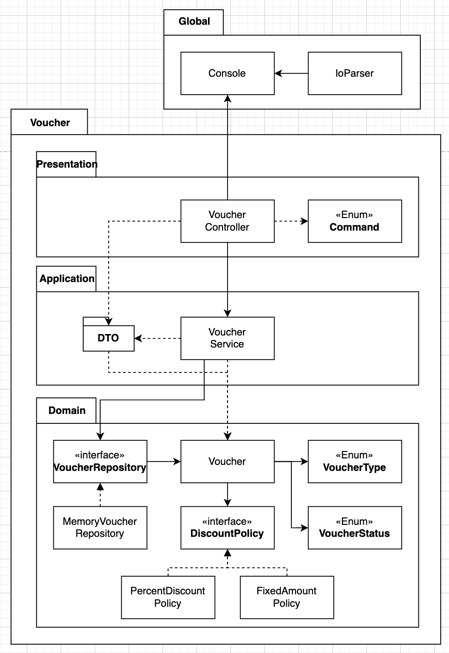

(기본) **바우처 관리 애플리케이션**
   ```bash
   === Voucher Program ===
   Type **exit** to exit the program.
   Type **create** to create a new voucher.
   Type **list** to list all vouchers.
   ```

### 🎨 그림 그리기


### 소개하기
- Voucher : `계산`의 책임을 가지고 있다.
- Status, Type : inner class로 바우처의 상태를 가진다. `상태 확인`의 책임있다.
- Repository : 바우처 저장소 역할을 가지고 있다. `모두 찾기`와 `저장`의 책임이 있다.
- Service : 비지니스 로직의 역할을 가지고 있다. `검증`에 대한 책임이 있다.
- Controller : 외부 요청에 대한 응답하는 역할을 가지고 있다, `맞는 요청에 매핑`하는 책임을 가진다.
- Console : 입출력을 담당한다.
- Parser : 변환을 담당한다. `변환`과 `검증`의 책임을 가진다.

### 요구사항
- [ ]  create / list 커맨드를 지원한다.
  - create 커맨드를 통해 바우처를 생성할수 있다. (FixedAmountVoucher, PercentDiscountVoucher)
    - list 커맨드를 통해 만들어진 바우처를 조회할 수 있다.
    - 바우처 정보를 매모리에 관리한다. 어플리케이션이 종료가 되어 데이터가 모두 사라져도 괜찮습니다. (나중에 영속성을 가지도록 변경할거에요 걱정마세요!)
- [ ]  적절한 로그를 기록하고 `logback` 설정을 해서 에러는 파일로 기록된다.
- [ ]  실행가능한 `jar` 파일을 생성한다.

(심화) 파일을 통한 데이터관리 기능과 고객 블랙 리스트 명단 관리기능

- [ ]  메모리 관리가 아닌 파일로 관리가 되는 Repository를 한번 만들어보세요.
    - 기존 메모리 레포지토리는 지우지 말고 개발 프로파일에서만 동작하게 해보세요.
- [ ]  고객 블랙 리스트 명단을 작성한다.
- customer_blacklist.csv 파일을 만들고 스프링 애플리케이션에서 해당 파일을 읽을 수 있고 블랙 리스트조회 할 수있다 (추가할 필요는 없어요. 블랙리스트는 파일로만 관리된다고 가정합니다.)
- [ ]  YAML 프라퍼티를 만들고 어떤 설정을 만들수 있을지 고민해본다.
