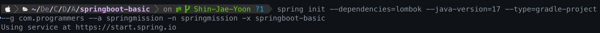

## 📌 과제 설명

- [x] Spring Boot CLI 이용 Gradle 프로젝트 구성
  - 
- [ ] 바우처 관리 Command-line Application 제작
  - [링크](https://dzone.com/articles/interactive-console-applications-in-java) 참고하여 `text-io` 라이브러리 사용하기
  - [ ] 스프링부트 애플리케이션으로 생성 (Web 없이)
  - [ ] 프로그램이 시작하면 아래와 같이 지원가능한 명령어 알려줌

```shell
=== Voucher Program ===
Type "exit" to exit the program.
Type "create" to create a new voucher.
Type "list" to list all vouchers.
```

  - [ ] create / list 커맨드 지원
    - create 커맨드를 통해 바우처 생성 가능 (FixedAmountVoucher, PercentDiscountVoucher)
    - list 커맨드를 통해 만들어진 바우처 조회 가능
    - `this.바우처` 정보를 메모리에서 관리. (당장은 영속성 고려 X)
  - [ ] 적절한 로그를 기록하고 `logback` 설정을 해서 에러는 파일로 기록됨
  - [ ] 실행가능한 `jar` 파일 생성

<br>

**(심화) 파일을 통한 데이터 관리기능과 고객 블랙 리스트 명단 관리기능**
- [ ] 메모리 관리가 아닌 파일로 관리가 되는 Repository
  - 기존 메모리 repository 지우지 말고 개발 프로파일에서만 동작하도록
- [ ] 고객 블랙 리스트 명단 작성
  - `customer-blacklist.csv` 파일 만들고 스프링 애플리케이션에서 해당 파일 읽을 수 있고 블랙 리스트 조회 가능
- [ ] YAML 프로퍼티 생성하고 어떤 설정을 만들 수 있을 지 고민