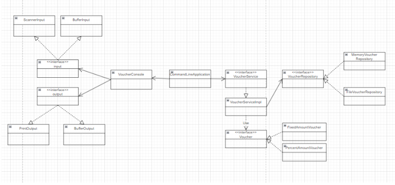

# SpringBoot Basic Weekly Mission
스프링부트 basic 위클리미션을 코드리뷰하는 Repository입니다.

## 설계도

#### before


#### after


## 요구 사항
(기본) **바우처 관리 애플리케이션**

- [x]  Maven / Gradle 로 프로젝트를 실제로 구성하고 이때 Spring Boot CLI를 개발PC에 설치해서 명령어들을 사용해보고 프로젝트를 만든다. 그리고 IDE (IntelliJ)에서 실행시켜 본다.
- [x]  바우처 관리 Command-line Application을  만들어본다.
    - 참고: https://dzone.com/articles/interactive-console-applications-in-java
    - [x]  스프링부트 애플리케이션으로 만든다. (Web기능이 없이 만듭니다. 즉, 서버가 띄지 않고 커맨드라인 애플리케이션으로 동작해야한다.)
    - [x]  프로그램이 시작하면 다음과 같이 지원가능한 명령어를 알려준다.
    
    ```bash
    === Voucher Program ===
    Type **exit** to exit the program.
    Type **create** to create a new voucher.
    Type **list** to list all vouchers.
    ```
    
    - [x]  create / list 커맨드를 지원한다.
        - create 커맨드를 통해 바우처를 생성할수 있다. (FixedAmountVoucher, PercentDiscountVoucher)
        - list 커맨드를 통해 만들어진 바우처를 조회할 수 있다.
        - this바우처 정보를 매모리에 관리한다. 어플리케이션이 종료가 되어 데이터가 모두 사라져도 괜찮습니다. (나중에 영속성을 가지도록 변경할거에요 걱정마세요!)
- [x]  적절한 로그를 기록하고 `logback` 설정을 해서 에러는 파일로 기록된다.
- [x]  실행가능한 `jar` 파일을 생성한다.

## 리뷰 수정 사항
- spring framework 4.3 부터는 @Autowired 없이 생성자만으로 빈 주입 가능
  - @Autowired 삭제
- Enum 타입의 `==` 비교
  - NullPointException x, 컴타일 타임에 타입 호환성 검사
- CommandLineRunner을 통해 직접 빈을 찾아서 실행 시켜주지 않고 실행 시점을 지정
- input, output 인터페이스 확장 삭제
- 도메인 객체의 toString() @Override 지양
- Collections.unmodifiableList를 사용해 불변 보장
- 단순 순회시 stream보단 향상된 for문 사용
- 책임 위임
